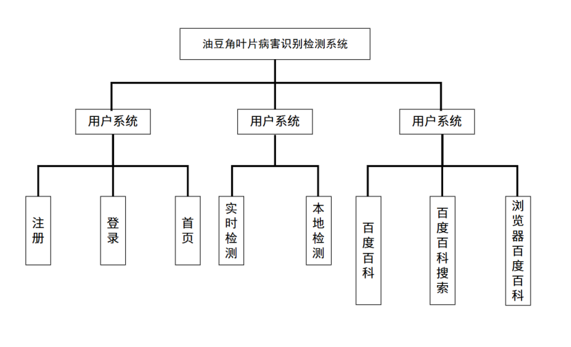
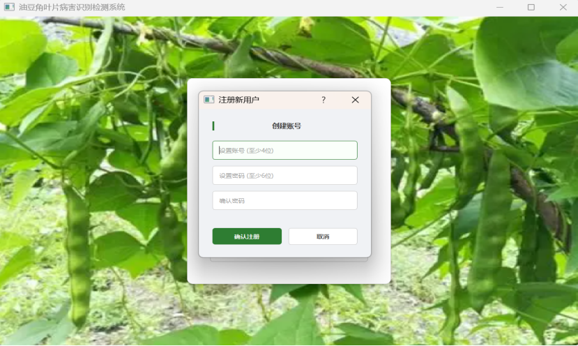
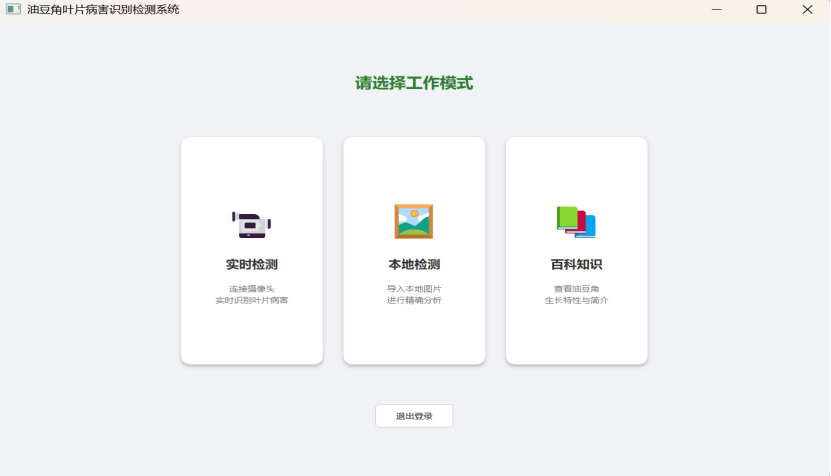
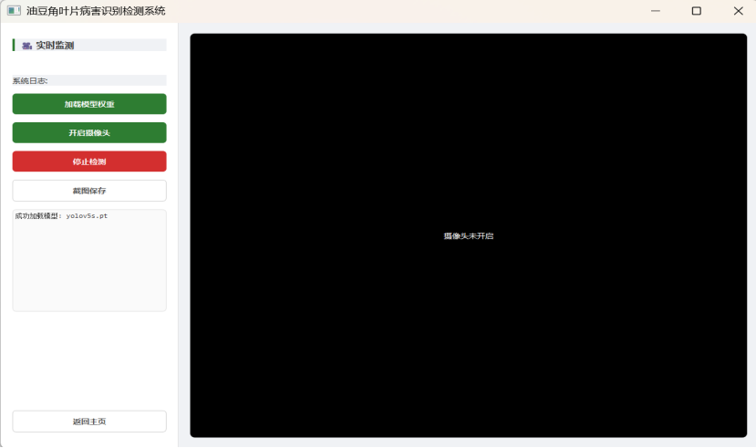
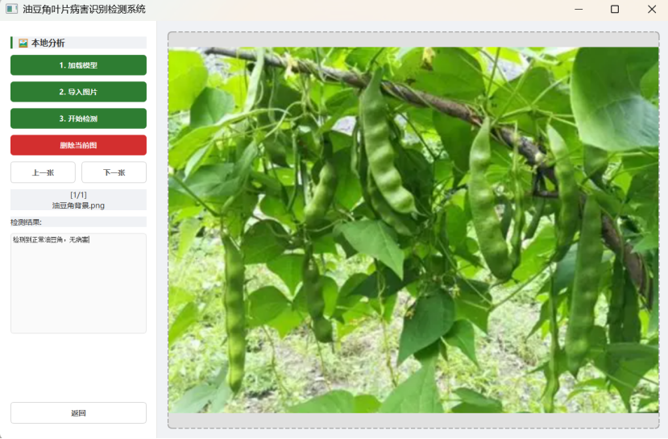
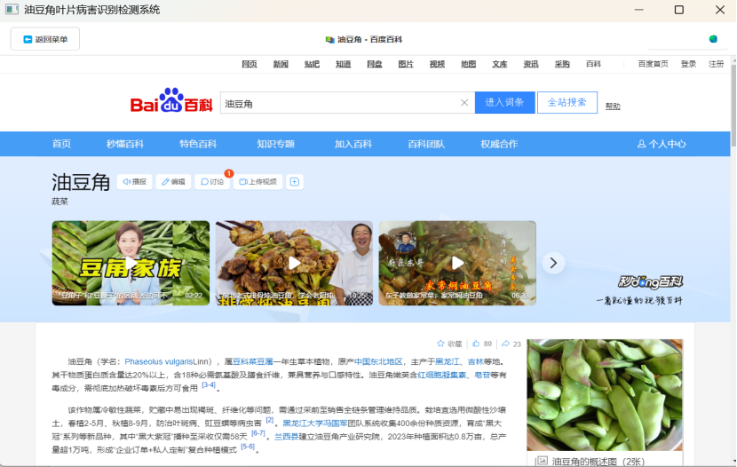

# 油豆角叶片病害识别检测系统 V1.0（油病通 1.0）

> 基于 YOLOv8 + PyQt5 实现的油豆角叶片病害智能识别检测系统（已获计算机软件著作权）

------

## 项目信息

- **软件全称**：油豆角叶片病害识别检测系统 V1.0
- **开发完成日期**：2025-12-06
- **软件分类**：应用
- **面向领域**：植物病害诊断
- **软件类型**：人工智能软件

------

##  运行环境

| 项目     | 详情                                  |
| -------- | ------------------------------------- |
| 开发硬件 | Intel i7-13700H / 16GB 内存 / 1TB SSD |
| 运行硬件 | 通用 PC 计算机                        |
| 开发系统 | Windows 11                            |
| 运行系统 | Windows / Linux / macOS               |
| 开发语言 | Python                                |
| 开发工具 | Python 3.8、PyCharm                   |

------

## 技术特点

- 基于 **YOLOv8** 深度学习模型，实现高精度病害识别
- 采用 **PyQt5** 构建可视化客户端界面
- **C/S 架构**，支持本地离线运行，无需依赖云端 API
- 数据本地处理，保障隐私与使用安全
- 实时检测、置信度输出、病害百科一体化

------

## 主要功能

1. **用户系统**：注册登录、个人中心、数据看板
2. **智能识别**：油豆角叶片病害实时检测、结果与置信度显示
3. **病害百科**：油豆角相关知识介绍与病害说明
4. **离线运行**：纯本地部署，不依赖网络与云端接口

------

## 页面展示















## 项目结构

```
Snap-bean_detect/
├── yolo_detect.py    # 核心检测逻辑
├── README.md         # 项目说明
├── 油豆角背景.png    # 界面资源
└── ...
```

------

## 使用方式

```
# 运行主程序
python yolo_detect.py
```